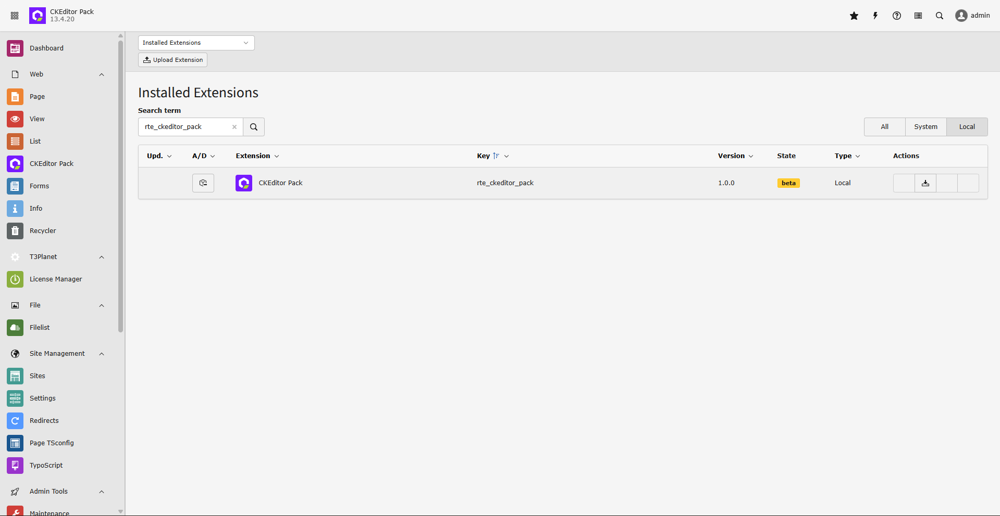

.. include:: ../Includes.txt

.. _quickinstallation:

Quick Installation 
========================

Installing the CKEditor Pack extension is easy. Follow the steps below to add the extension to your TYPO3 environment.

Via Composer using Command Line
-------------------------------

.. code-block:: bash

   composer req t3planet/rte-ckeditor-pack

Via Extensions Module
---------------------

In the TYPO3 backend you can use the extension manager (EM).

- Step 1. Switch to the module “Extension Manager”.

- Step 2. Get the extension

- Step 3. Get it from the Extension Manager: Press the “Retrieve/Update” button and search for the extension key ``rte_ckeditor_pack`` and import the extension from the repository.

- Step 4. Get it from typo3.org: 

You can always get the current version from  https://extensions.typo3.org/extension/rte_ckeditor_pack/  by downloading either the t3x or zip version. Upload the file afterwards in the Extension Manager.

