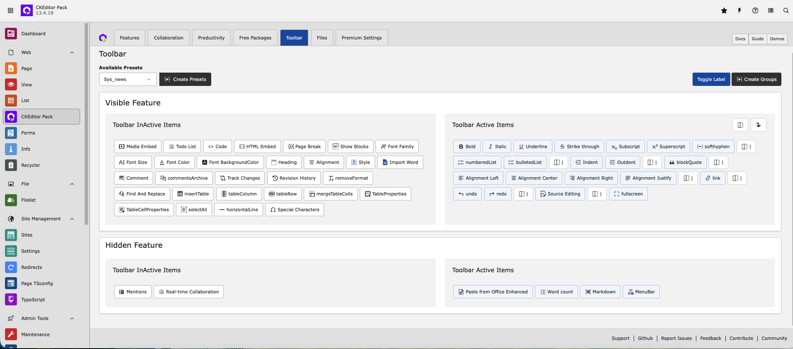

.. include:: ../Includes.txt

.. _toolbarandpresets:

==================
Toolbar & Presets
==================

You can easily create your own RTE presets or edit your preset using the drag-and-drop UI toolbar management. Take a look at the interactive demo below::

.. rst-class:: horizbuttons-attention-m

   - `View Interactive Guide <https://app.supademo.com/demo/cmhyjl7xp4l1617y0gi1erk6t>`_

.. note::

   The extension replaces any custom YAML configuration while active. The backend module relies solely on the settings provided by the extension. For any required changes, please coordinate with the extension's core team.