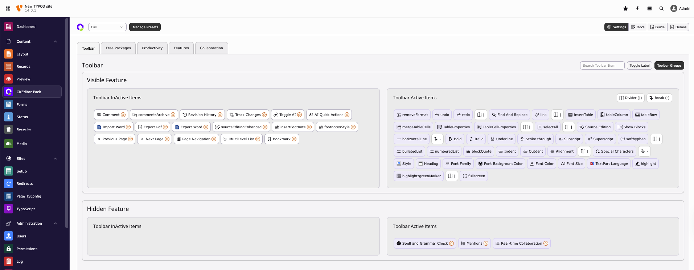

.. include:: ../Includes.txt

.. _toolbarandpresets:

==================
Toolbar & Presets
==================

You can easily create your own RTE presets or edit your preset using the drag-and-drop UI toolbar management. Take a look at the interactive demo below::

.. rst-class:: horizbuttons-attention-m

   - `View Interactive Guide <https://app.supademo.com/demo/cmir7k9mw0rsjl82161ungk5i?preview=true&step=2>`_

Advanced Features for Managing RTE Presets
===========================================

We have added new preset management features in CKEditor to support both editors and developers, making configuration handling faster, safer, and more consistent.

1. Load from YAML
---------------------

The Load from YAML feature retrieves the default RTE configuration directly from the TYPO3 core YAML file. It allows integrators to access or restore the original settings quickly, without manually navigating system directories.

.. rst-class:: horizbuttons-attention-m

   - `View Interactive Guide <https://app.supademo.com/demo/cmirfho5i150pl821fkxxm2ji?step=2>`_

2. Reset
-----------------

The Reset feature clears database overrides for a preset (toolbar items and stored
feature configuration rows). After a reset, the editor falls back to the YAML
preset definition. Use this when experimental UI changes should be discarded.

.. rst-class:: horizbuttons-attention-m

   - `View Interactive Guide <https://app.supademo.com/demo/cmiresoe813yql821w5tt6n1r?step=3>`_

3. Sync
-----------------

The Sync feature performs an **additive** merge:

- Keeps the current database toolbar order
- Appends toolbar items that exist in YAML but are missing in the database
- Merges feature field configuration from YAML into existing database feature rows

Sync does **not** replace the database configuration with YAML verbatim. If YAML
must be the single source of truth, use **strict** mode via the CLI (see below).

.. rst-class:: horizbuttons-attention-m

   - `View Interactive Guide <https://app.supademo.com/demo/cmirg3t7q15sll821k3ahlmmx?step=2>`_

CLI: Sync presets from YAML
---------------------------

Preset sync logic is available as a reusable service and console command so you
can update ``tx_rteckeditorpack_domain_model_preset`` without using the backend
module.

.. code-block:: bash

   # Additive sync (same behaviour as the backend Sync button) for all DB presets
   vendor/bin/typo3 rteckeditorpack:presets:sync

   # Sync one preset by key
   vendor/bin/typo3 rteckeditorpack:presets:sync --preset=editing-preset

   # Preserve DB-only tools and insert missing YAML tools near their YAML position
   vendor/bin/typo3 rteckeditorpack:presets:sync --preset=editing-preset --mode=ordered

   # YAML is authoritative (toolbar + feature configs written from YAML)
   # Prompts for confirmation; use --force to skip in scripts
   vendor/bin/typo3 rteckeditorpack:presets:sync --preset=editing-preset --strict

   # Clear DB overrides (same idea as the backend Reset button)
   vendor/bin/typo3 rteckeditorpack:presets:sync --preset=editing-preset --mode=reset

   # Non-interactive / CI: skip the confirmation prompt
   vendor/bin/typo3 rteckeditorpack:presets:sync --preset=editing-preset --strict --force

======== ================================ ===============================================
Mode     Option                           Behaviour
======== ================================ ===============================================
additive ``--mode=additive`` (default)    Keep DB order; append missing YAML items
ordered  ``--mode=ordered``               Keep DB-only items; position new YAML items
strict   ``--strict`` / ``--mode=strict`` YAML wins verbatim in the database
reset    ``--mode=reset``                 Clear DB toolbar + feature rows for the preset
======== ================================ ===============================================

.. note::

   **Ordered** keeps the relative order of items that are already stored in the
   database. It only inserts **missing** YAML items near their YAML neighbours.
   It does **not** reorder existing toolbar items to match YAML. If the full YAML
   toolbar order must be applied, use **strict**.

**Confirmation:** ``strict`` and ``reset`` show a short warning and ask
*Are you sure you want to proceed?* before changing data. Use ``--force``
(or ``-f``) to skip the prompt in scripts / CI.

Strict versus Reset
^^^^^^^^^^^^^^^^^^^^

Although both modes can make the editor behave according to YAML, they update
the database differently:

**Strict**
   Copies the YAML toolbar and feature configuration into the existing database
   rows. The database remains populated and matches YAML immediately. Use this
   whenever YAML must be the authoritative configuration.

**Reset**
   Clears the toolbar override and removes the stored feature rows. It does
   **not** copy YAML into the database. The editor falls back to the registered
   YAML preset when it loads. Use this to discard backend customizations and
   return to default behavior. Reset is idempotent: if no active overrides
   remain, the command still reports a successful reset.

For example, when YAML contains ``bold,italic``:

.. code-block:: text

   strict  -> DB toolbar: "bold,italic"
   reset   -> DB toolbar: ""

Use **strict** to write YAML into the database. Use **reset**
for an administrator's "undo my backend changes" action.

The command flushes the ``rte_ckeditor_config`` cache after a successful sync.
Custom database-only presets are always excluded from sync and reset because
they have no YAML source. When syncing all presets, other database rows without
a currently registered YAML source are also reported as skipped. Skipped rows
do not cause the command to fail. Sync compares the resulting toolbar and
feature configuration with the stored database values. It reports
``Nothing to sync`` when no values changed and reports a successful sync only
when it updated the preset.

4. Import / Export Presets
-------------------------

The Import / Export Presets feature allows you to easily manage and share CKEditor presets between different TYPO3 environments. It helps you keep the same editor configuration across local, staging, and live systems without manual setup.

Import Presets
^^^^^^^^^^^^^^

The Import Presets option lets you add CKEditor presets from a YAML file into your TYPO3 system.  
This is useful when you receive a preset from another environment or project and want to reuse the same editor setup.

Simply upload the YAML file, and the preset will be created automatically with all toolbar buttons, groups, and settings.

.. rst-class:: horizbuttons-attention-m

   - `View Interactive Guide <https://app.supademo.com/embed/cmjcvzsq24n7lf6zp2wlvrmgm?embed_v=2&utm_source=embed>`_

Export Presets
^^^^^^^^^^^^^^

The Export Presets option allows you to download existing or custom CKEditor presets as a YAML file.  
This makes it easy to share presets with other TYPO3 systems or team members.

You can select a preset and export it, then import the same file into another TYPO3 installation to get the exact same configuration.

.. rst-class:: horizbuttons-attention-m

   - `View Interactive Guide <https://app.supademo.com/embed/cmjcvdeyg4mjzf6zpd00w121z?embed_v=2&utm_source=embed>`_

.. note::

   When exporting presets, the following features are **not included**
   in the generated YAML file:

   - Document Outline
   - Paste Office Enhanced
   - Editoria11y
   - Markdown