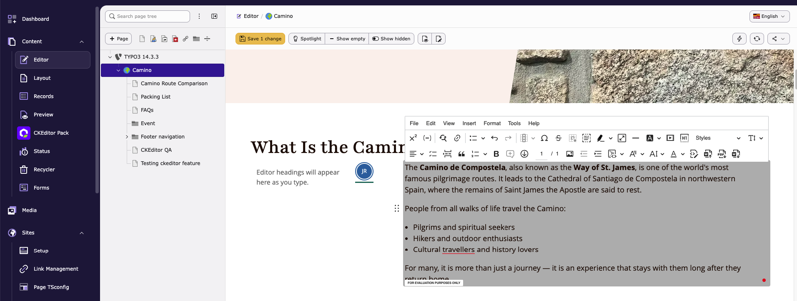

.. include:: ../Includes.txt

.. _visualeditor:

==============
Visual Editor
==============

CKEditor Pack works seamlessly with TYPO3's **Visual Editor** module. Editors can use
the same CKEditor presets, toolbar configuration, and premium features directly inside the
page-based Visual Editor workflow — not only in classic FormEngine record editing.

Overview
========

When the ``visual_editor`` system extension is active, CKEditor Pack renders rich-text
fields inside the Visual Editor preview iframe (``editMode=1``). The extension reuses the
same database-backed presets from the CKEditor Pack module, so toolbar items, enabled
features, and processing rules stay consistent between:

- classic backend FormEngine RTE fields, and
- Visual Editor inline editing (``ve-editable-rich-text``).

No separate Visual Editor preset is required.

Requirements
============

- **TYPO3:** v13.0 or newer
- **Extension:** ``visual_editor`` system extension installed and enabled
- **CKEditor Pack:** configured preset (for example ``camino_default`` or a custom preset)

Opening the Visual Editor
=========================

1. Log in to the TYPO3 backend.
2. Open **Web → Visual Editor**.
3. Select the page you want to edit.
4. Click an editable rich-text content element.
5. CKEditor loads inside the nested preview iframe with the configured preset toolbar.

   CKEditor Pack in TYPO3 Visual Editor

Collaboration
=============

CKEditor Pack also brings collaboration features into Visual Editor, including:

- Real-time collaboration
- Comments
- Track changes
- Revision history

Collaboration uses the same preset configuration and channel setup as classic backend
editing, so teams can work on content directly from the Visual Editor page view.

Related documentation
=====================

- :ref:`features`
- :ref:`toolbar&presets`
- :ref:`premiumfeatures`
- :ref:`ckeditorai`
